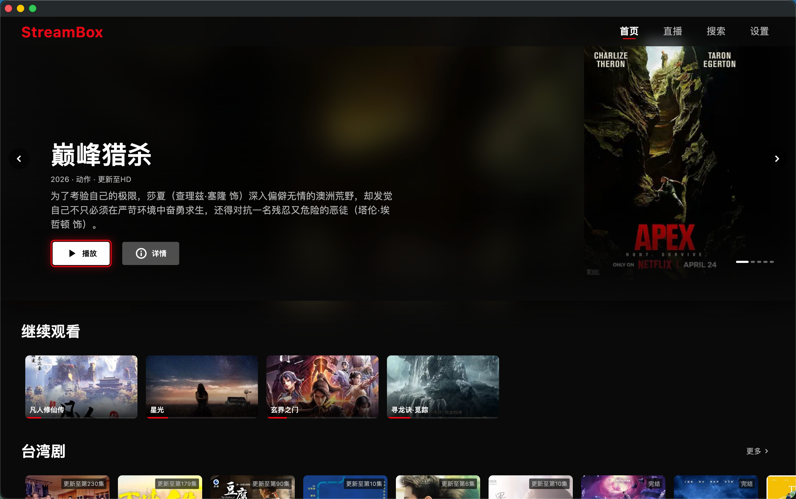

# StreamBox

Netflix 风格的跨平台流媒体播放器，对接 TVBox 生态片源。本仓库为 Monorepo，包含 Flutter 客户端和 JAR Bridge 中间服务。

## 预览



<video src="https://github.com/huangj17/StreamBox-APP/raw/main/client/assets/StreamBox.mp4" controls width="720"></video>

> 视频如未在 GitHub 网页内联播放，可点击 [此处下载查看](client/assets/StreamBox.mp4)。

## 仓库结构

| 目录             | 说明                                  | 技术栈                              | README                                         |
| ---------------- | ------------------------------------- | ----------------------------------- | ---------------------------------------------- |
| `client/`        | Flutter 客户端（主应用）              | Flutter/Dart + Riverpod + media_kit | [client/README.md](client/README.md) |
| `jar-bridge/`    | JAR Bridge 中间服务（JAR 插件运行时） | Kotlin + Ktor + Gradle              | [jar-bridge/README.md](jar-bridge/README.md)   |

## 架构关系

```
StreamBox (Flutter)  --HTTP-->  JAR Bridge (JVM)  --Spider-->  内容站点
                                    |
                                    v
                              plugins/ 目录下的 .jar 文件
```

- 客户端通过 HTTP 连接 Bridge，Bridge 对客户端来说就是一个普通的 CMS 源
- 每个 JAR 源的 API 格式与苹果 CMS 完全兼容（`ac=class`、`ac=detail`、`wd=` 等）
- Bridge 是可选组件，StreamBox 在没有 Bridge 时仍可正常使用 CMS 源
- 客户端默认连接 `http://localhost:9978`

## 快速开始

无根级构建工具。命令必须在子项目目录下执行。

### 仅 CMS 源（不需要 JAR 插件）

```bash
cd client
flutter pub get
flutter run -d macos
```

### 含 JAR 源（需要 Bridge）

```bash
# 终端 1：启动 Bridge
cd jar-bridge
./gradlew run                       # 监听 0.0.0.0:9978

# 终端 2：启动客户端
cd client
flutter run -d macos
```

详细配置（添加 JAR 插件、DEX 转换、API 端点等）见 [jar-bridge/README.md](jar-bridge/README.md)。

## 环境要求

| 子项目        | 依赖                                          |
| ------------- | --------------------------------------------- |
| client        | Flutter SDK >= 3.11、Dart SDK >= 3.11、CocoaPods（macOS） |
| jar-bridge    | JDK 21+                                       |

## 路线图

欢迎通过 Issue / PR 参与贡献。优先级以用户反馈为准。

### 优化项

- [ ] **TV 遥控器交互** — 焦点流转、按键映射、长按行为打磨
- [ ] **切源稳定性** — 消除偶发的"切源失败需多次点击"问题
- [ ] **大列表滚动性能** — 封面预取与图片缓存策略
- [ ] **错误提示与重试** — 网络异常的引导更友好，避免空白页

### 待开发功能

- [ ] **直播频道** — IPTV / M3U 源支持
- [ ] **弹幕** — 第三方弹幕源对接
- [ ] **投屏** — DLNA / AirPlay / Chromecast
- [ ] **字幕** — 外挂字幕加载、字号 / 颜色 / 偏移调整
- [ ] **跳过片头片尾** — 手动设置 + 自动记忆
- [ ] **搜索增强** — 历史记录、关键词建议、按类型/年份筛选
- [ ] **国际化（i18n）** — 多语言界面
- [ ] **主题** — 亮色 / 暗色 / 自定义强调色

## 贡献

欢迎 Issue 和 PR。提交前请阅读 [CONTRIBUTING.md](CONTRIBUTING.md)：

- Bug / 功能建议走 [Issues](https://github.com/huangj17/StreamBox-APP/issues)，使用对应模板
- 较大改动先开 Issue 讨论再写代码
- `main` 分支受保护，所有改动须通过 PR + 1 个 approval

## 许可证

[MIT License](LICENSE)。本项目仅作技术研究与学习用途，使用者需自行确保所接入的内容源合法合规，与本项目作者无关。
