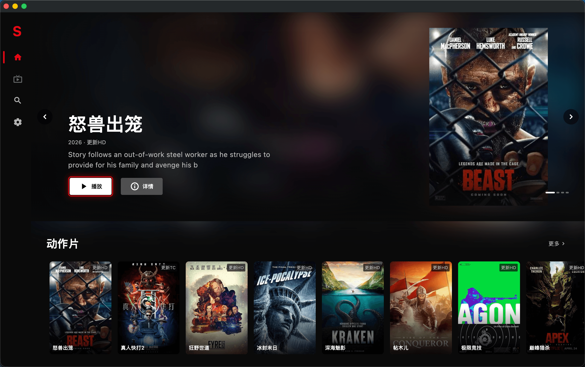

# StreamBox

Netflix 风格的跨平台流媒体播放器，对接 TVBox 生态片源。本仓库为 Monorepo，包含 Flutter 客户端和 JAR Bridge 中间服务。**（可安装至TV电视、投影仪等）**

## 预览



<video src="https://github.com/huangj17/StreamBox-APP/raw/main/client/assets/StreamBox.mp4" controls width="720"></video>

> 视频如未在 GitHub 网页内联播放，可点击 [此处下载查看](client/assets/StreamBox.mp4)。

## 仓库结构

| 目录          | 说明                                  | 技术栈                              | README                                       |
| ------------- | ------------------------------------- | ----------------------------------- | -------------------------------------------- |
| `client/`     | Flutter 客户端（主应用）              | Flutter/Dart + Riverpod + media_kit | [client/README.md](client/README.md)         |
| `jar-bridge/` | StreamBox Gateway（CMS + JAR 运行时） | Kotlin + Ktor + Gradle              | [jar-bridge/README.md](jar-bridge/README.md) |

## 架构关系

```
StreamBox (Flutter) --HTTP--> StreamBox Gateway --Spider--> 内容站点
                               |
                               v
                    config.yml + plugins/*.jar
```

- Gateway 属于 StreamBox 本项目，通过 `/api/list` 发现手工配置的 JAR 片源
- Gateway 不自带片源，需要自行准备 Spider JAR 并写入 `config.yml`
- 每个 source 的 API 格式与苹果 CMS 完全兼容（`ac=class`、`ac=detail`、`wd=` 等）
- Gateway 是可选组件，StreamBox 在没有 Gateway 时仍可直接使用 CMS 源
- 客户端默认连接 `http://localhost:9978`

## 快速开始

根目录的 `dev.sh` 封装了两个子项目的常用命令，不用手动 `cd`：

```bash
./dev.sh            # Bridge（后台）+ 客户端（前台），退出时自动收掉 Bridge
./dev.sh bridge     # 只启动 JAR Bridge
./dev.sh client     # 只启动 Flutter 客户端
./dev.sh stop       # 停掉后台 Bridge
./dev.sh test       # 两个子项目的 analyze + test
./dev.sh build      # 两个子项目的构建
./dev.sh --help     # 全部用法

DEVICE=chrome ./dev.sh client        # 换目标设备
./dev.sh client --verbose            # 额外参数透传给 flutter run
```

也可以按下面的方式手动在子项目目录下执行。

### 仅 CMS 源（不需要 JAR 插件）

```bash
cd client
flutter pub get
flutter run -d macos
```

### 含 JAR 源（需要 Bridge）

```bash
# 终端 1：启动 Bridge
cd jar-bridge
./gradlew run                       # 监听 0.0.0.0:9978

# 终端 2：启动客户端
cd client
flutter run -d macos
```

详细配置（添加 JAR 插件、DEX 转换、API 端点等）见 [jar-bridge/README.md](jar-bridge/README.md)。

## 环境要求

| 子项目     | 依赖                                                      |
| ---------- | --------------------------------------------------------- |
| client     | Flutter SDK >= 3.11、Dart SDK >= 3.11、CocoaPods（macOS） |
| jar-bridge | JDK 21+                                                   |

## 路线图

欢迎通过 Issue / PR 参与贡献。优先级以用户反馈为准。

### 优化项

- [x] **TV 遥控器交互** — 焦点流转、按键映射、长按行为打磨
  - 首页 `SideNavBar` 替代 TopNav，悬浮展开，左红条选中态 + 红环焦点态
  - 详情页 / 搜索页 / 设置页 / 收藏 / 历史 全面接入 `TvFocusable` 红环+光晕规范
  - 详情页：autofocus「播放」/「继续观看」、长按 OK 集数弹「从头播放 / 复制链接」、续播文案「继续 第 N 集 mm:ss」+「从头播放」次按钮、长简介展开模态
  - 搜索页：autofocus 输入框、历史 chip 长按 OK 删除、错误文案收敛（不再 dump stack）
  - 共享组件 `TvActionButton`（primary/secondary/red/text）+ `TvBackButton` 统一全站按钮焦点视觉
- [x] **切源稳定性** — 消除偶发的"切源失败需多次点击"问题
  - 历史/收藏/搜索/Banner Play 5 处 `firstWhere` 静默吞 `StateError` 导致「点不动」 → 统一走 `navigateToVideoDetail` helper：找不到源弹 SnackBar「『xxx』所在的片源已下架或未启用」+「去搜索」action 预填关键词跨源回查
  - 历史 tile 失效项视觉降级：封面灰化 + 红字「片源已下架」
- [ ] **大列表滚动性能** — 封面预取与图片缓存策略
- [x] **错误提示与重试** — 网络异常的引导更友好，避免空白页
  - 搜索 `_friendlyError`：500 → 「服务暂不可用」、SocketException/Timeout → 「网络不可达」、其它截 60 字
  - 详情 `加载失败: 该片源暂不支持此视频`（500 分支）替代裸 stack
  - 播放器 30 秒首帧 stuck timeout：libmpv 卡 buffering 不报错时自动弹「重试 / 切线路」遮罩，不再永远转圈
  - 失效片源 SnackBar 反馈 + 跨源回查（见上）
- [x] **首屏起播提速 & 稳定性** — DNS 预解析 + libmpv 调优
  - 详情页进入时对最可能播放的 URL 做 DNS 预解析（`InternetAddress.lookup`），节省 50–200 ms 首帧时间。原 `dio.head` 预热被部分站点视为消耗单次 token 导致 libmpv 拿不到流，已停用
  - libmpv：`bufferSize 64 MiB` / `cache-secs 30` / `demuxer-readahead-secs 20` / `cache-pause-initial no` / `network-timeout 10` / `vd-lavc-threads 4`

### 待开发功能

- [ ] **直播频道** — IPTV / M3U 源支持
- [ ] **弹幕** — 第三方弹幕源对接
- [ ] **投屏** — DLNA / AirPlay / Chromecast
- [ ] **字幕** — 外挂字幕加载、字号 / 颜色 / 偏移调整
- [ ] **跳过片头片尾** — 手动设置 + 自动记忆
- [ ] **搜索增强** — 历史记录、关键词建议、按类型/年份筛选
- [ ] **国际化（i18n）** — 多语言界面
- [ ] **主题** — 亮色 / 暗色 / 自定义强调色

## 贡献

欢迎 Issue 和 PR。提交前请阅读 [CONTRIBUTING.md](CONTRIBUTING.md)：

- Bug / 功能建议走 [Issues](https://github.com/huangj17/StreamBox-APP/issues)，使用对应模板
- 较大改动先开 Issue 讨论再写代码
- `main` 分支受保护，所有改动须通过 PR + 1 个 approval

## 许可证

[MIT License](LICENSE)。本项目仅作技术研究与学习用途，使用者需自行确保所接入的内容源合法合规，与本项目作者无关。
