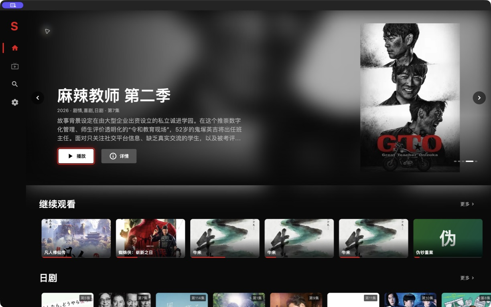
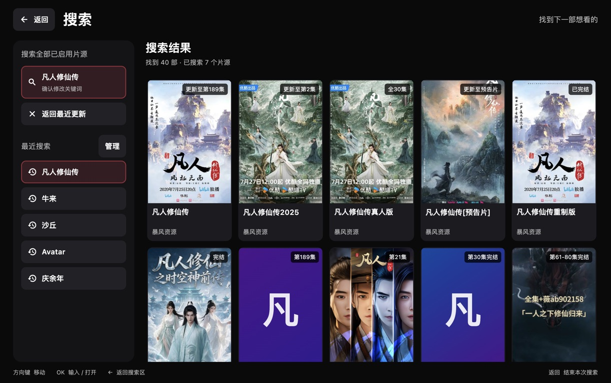
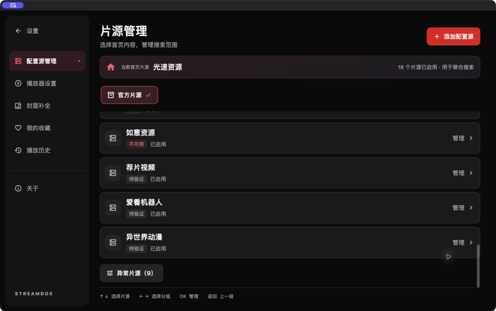
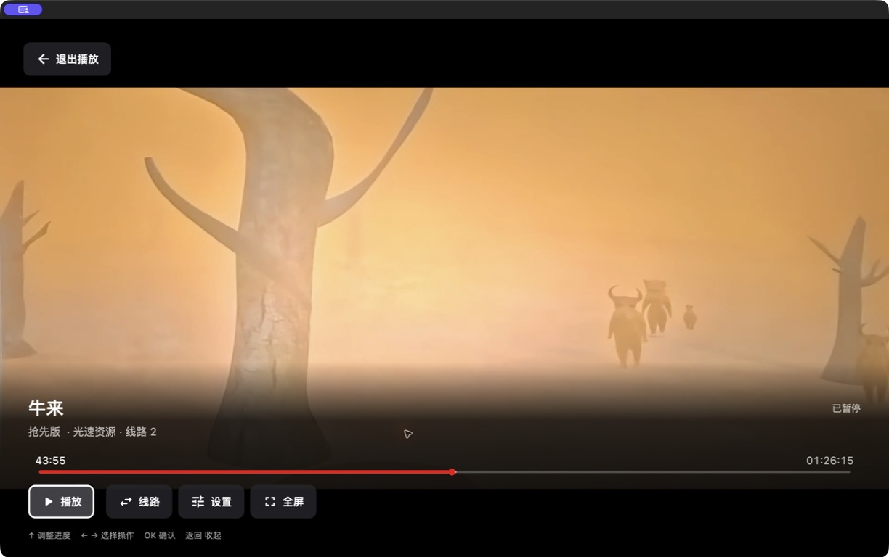
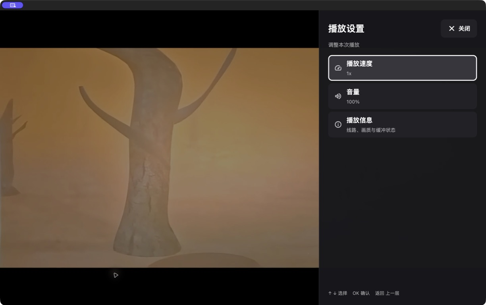

# StreamBox

Netflix 风格的跨平台流媒体播放器，对接 TVBox 生态片源。以电视、电视盒子和投影仪的遥控器操作为优先，同时适配桌面键鼠与手机触摸。本仓库为 Monorepo，包含 Flutter 客户端和 JAR Bridge 中间服务。

## 页面与交互

- **沉浸首页**：侧边导航、轮播推荐、继续观看和分类内容行；首页片源统一在设置中选择，顶部不再占用一整行。
- **聚合搜索**：宽屏采用左侧搜索与历史、右侧结果网格；加宽海报卡片，片名与来源分层显示，方向键移动时自动滚动并保留焦点。
- **遥控播放**：底部集中显示时间轴和常用操作，选集、线路与设置使用侧栏；左右键调整进度，松手自动跳转。
- **片源管理**：显示当前首页片源与搜索范围，按官方片源和自定义集合切换；确认片源行即可设置首页、启停片源或重新检测。健康检测最多 6 个片源同时进行，完成即补位，单源 12 秒超时；「等待检测」与「检测中」分别显示。

具体操作见 [客户端使用方法与遥控器指南](client/README.md#使用方法)。

## 预览

以下为 2026-09-03 在 macOS 运行当前版本截取的真实页面。截图展示宽屏布局；TV 遥控器与系统输入法仍需实机验收。



| 搜索：加宽卡片、搜索历史与来源信息 | 设置：片源分组、首页选择与搜索范围 |
| --- | --- |
|  |  |
| 播放：时间轴与常用操作集中在底部 | 播放侧栏：倍速、音量与播放信息 |
|  |  |

点击图片可查看大图。[截图说明](client/assets/screenshots/README.md)。

### 早期版本演示视频

<video src="https://github.com/huangj17/StreamBox-APP/raw/main/client/assets/StreamBox.mp4" controls width="720"></video>

> 视频保留早期版本的操作演示，当前界面以上方截图为准。如未在 GitHub 网页内联播放，可点击 [此处下载查看](client/assets/StreamBox.mp4)。

## 仓库结构

| 目录          | 说明                                  | 技术栈                              | README                                       |
| ------------- | ------------------------------------- | ----------------------------------- | -------------------------------------------- |
| `client/`     | Flutter 客户端（主应用）              | Flutter/Dart + Riverpod + media_kit | [client/README.md](client/README.md)         |
| `jar-bridge/` | StreamBox Gateway（CMS + JAR 运行时） | Kotlin + Ktor + Gradle              | [jar-bridge/README.md](jar-bridge/README.md) |

## 架构关系

```
StreamBox (Flutter) --HTTP--> StreamBox Gateway --Spider--> 内容站点
                               |
                               v
                    config.yml + plugins/*.jar
```

- Gateway 属于 StreamBox 本项目，通过 `/api/list` 发现手工配置的 JAR 片源
- Gateway 不自带片源，需要自行准备 Spider JAR 并写入 `config.yml`
- 每个 source 的 API 格式与苹果 CMS 完全兼容（`ac=class`、`ac=detail`、`wd=` 等）
- Gateway 是可选组件，StreamBox 在没有 Gateway 时仍可直接使用 CMS 源
- 原生产 Bridge 的三个片源与 CMS 源共用官方列表；本机 Bridge 可通过「添加配置源」接入 `http://localhost:9978`

## 快速开始

根目录的 `dev.sh` 封装了两个子项目的常用命令，不用手动 `cd`：

```bash
./dev.sh            # Bridge（后台）+ 客户端（前台），退出时自动收掉 Bridge
./dev.sh bridge     # 只启动 JAR Bridge
./dev.sh client     # 只启动 Flutter 客户端
./dev.sh stop       # 停掉后台 Bridge
./dev.sh test       # 两个子项目的 analyze + test
./dev.sh build      # 两个子项目的构建
./dev.sh --help     # 全部用法

DEVICE=chrome ./dev.sh client        # 换目标设备
./dev.sh client --verbose            # 额外参数透传给 flutter run
```

也可以按下面的方式手动在子项目目录下执行。

### 仅 CMS 源（不需要 JAR 插件）

```bash
cd client
flutter pub get
flutter run -d macos
```

### 含 JAR 源（需要 Bridge）

```bash
# 终端 1：启动 Bridge
cd jar-bridge
./gradlew run                       # 仅监听 127.0.0.1:9978

# 终端 2：启动客户端
cd client
flutter run -d macos
```

详细配置（添加 JAR 插件、DEX 转换、API 端点等）见 [jar-bridge/README.md](jar-bridge/README.md)。

### 官方片源远程配置（免重新安装）

安装支持远程配置的客户端后，只需维护服务器上的一个 JSON 文件，即可更新官方片源的地址、顺序和上下架状态。启动时后台同步，前台每 30 分钟检查，也可在「设置 → 配置源管理 → 官方片源」选择「立即更新」；网络失败时继续使用缓存，用户自定义源不被清理。

客户端不再内置暴风、红牛两个兜底源；首次未同步成功且没有缓存时，官方列表为空，需联网同步或添加自定义源。

片源页只展示简短同步状态；版本、地址、检查频率和完整错误可从「详情」查看。启动时会一次性移除已被官方缓存覆盖的重复 OuonnkiTV Lite 订阅，保留原地址、缓存及片源偏好，仍可手动重新添加恢复；含独有片源的订阅不受影响。

默认地址：[官方片源配置](http://1.14.171.39/streambox/sources.json)。支持 `id/name/url/isEnabled` 数组，无需手动填写版本号，并兼容旧对象格式。升级会将先前的 HTTPS 官方订阅迁移回此 IP，保留缓存和自定义源。当前入口使用 HTTP 明文传输，存在被篡改风险；固定官方配置入口及原生产 Bridge 的三个指定 API 允许 HTTP，其他订阅、CMS 和 Gateway 的安全限制不变。待发布的完整列表：[deploy/streambox/sources.json](deploy/streambox/sources.json)。上传路径、字段说明、发布校验、回滚和安全边界见 [远程配置部署指南](deploy/streambox/README.md)。

### 恢复原生产片源

[合并配置](deploy/streambox/sources.json) 保留 2026-09-03 线上已有的 16 个片源及顺序，在「官方片源」同一个列表末尾追加以下 3 个，共 19 个。更新客户端并将该文件发布到官方配置地址后，在设置中选择「立即更新」即可加载；不会添加独立分组，也不会改变当前首页或本地启停偏好。

| 片源 | 生产 CMS 接口 |
| --- | --- |
| 荐片视频 | `http://1.14.171.39:9978/api/jianpian` |
| 爱看机器人 | `http://1.14.171.39:9978/api/ikanbot` |
| 异世界动漫 | `http://1.14.171.39:9978/api/ysj` |

如果上传后这三个源仍显示「暂不兼容」，先更新并重启客户端。JSON 只更新片源目录，不会更新正在运行的程序；旧客户端仍会拦截这些 HTTP 接口。更新后「待验证」表示后台尚未测通媒体，不妨碍选择首页或尝试播放。

这三个接口由原 JAR Bridge 提供，客户端保留原片源身份、字符串影片 ID 和剧集解析流程；生产请求不发送个人 `STREAMBOX_GATEWAY_TOKEN`。片源增删、排序和启停仍由服务器 JSON 决定，没有额外的内置兜底列表。

验证范围：三个源的分类、搜索和详情可返回内容；2026-09-03 使用重新编译的 macOS 客户端，荐片视频《火遮眼2025》已实际播放并推进到 00:25；异世界动漫抽样线路仍返回需要网页解析的地址，当前播放器会明确提示无法直接播放。接口在线不代表全部影片或线路可播放。

## 环境要求

| 子项目     | 依赖                                                      |
| ---------- | --------------------------------------------------------- |
| client     | Flutter SDK >= 3.11、Dart SDK >= 3.11、CocoaPods（macOS） |
| jar-bridge | JDK 21+                                                   |

## 更新日志

各版本变更见 [CHANGELOG.md](CHANGELOG.md)，发布产物见 [Releases](https://github.com/huangj17/StreamBox-APP/releases)。

## 贡献

欢迎 Issue 和 PR。提交前请阅读 [CONTRIBUTING.md](CONTRIBUTING.md)：

- Bug / 功能建议走 [Issues](https://github.com/huangj17/StreamBox-APP/issues)，使用对应模板
- 较大改动先开 Issue 讨论再写代码
- `main` 分支受保护，所有改动须通过 PR + 1 个 approval

## 许可证

[MIT License](LICENSE)。本项目仅作技术研究与学习用途，使用者需自行确保所接入的内容源合法合规，与本项目作者无关。
